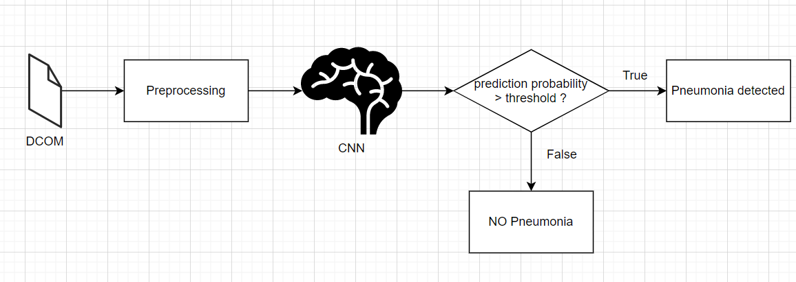
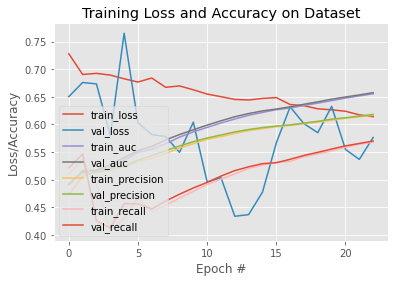
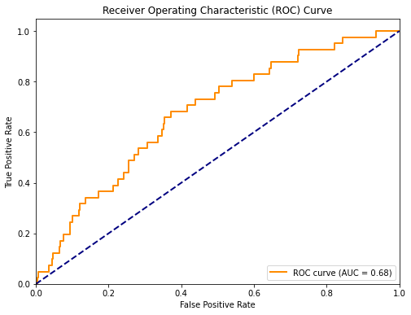

# FDA  Submission

**Your Name: Le Ngoc Anh**

**Name of your Device:**
X-Ray Pneumonia Analyzer

## Algorithm Description 

### 1. General Information

**Intended Use Statement:** 
Support radiologist to detect the presence or absence of pneumonia from Chest X-ray image

**Indications for Use:**
This algorithm is intended for use both man and woman from the ages of 1-95 who have taken X-Rays image of Chest on PA (Posteroanterior) or AP (Anteroposterior) position.

**Device Limitations:**
* This device is intended only for the analysis of chest X-ray images PA (Posteroanterior) or AP (Anteroposterior) position
* Image resolution is 224x224 pixels
* The model is designed specifically to detect pneumonia only and may not reliably detect other diseases on the chest X-Rays image

**Clinical Impact of Performance:**
* This model support radiologist to reduce the diagnostic time to detect pneumonia on chest x-rays image

### 2. Algorithm Design and Function

**DICOM Checking Steps:**
* The file extention is .dcm
* Can read the file using pydicom.dcmread
* the image is at pixel_array

**Preprocessing Steps:**
* Use ImageDataGenerator for Preprocessing

**CNN Architecture:**
* refer to "my_model.json"

### 3. Algorithm Training

**Parameters:**
* Types of augmentation used during training: 
ImageDataGenerator with  
horizontal_flip = True,  
vertical_flip = False,  
height_shift_range= 0.1,  
width_shift_range=0.1,  
rotation_range=20,  
shear_range = 0.1, 
zoom_range=0.1 
* Batch size : 16 
* Optimizer learning rate: Adam(lr=1e-4)
* Layers of pre-existing architecture that were frozen: vgg_model.layers[0:15]
* Layers of pre-existing architecture that were fine-tuned: vgg_model.layers[15:]
* Layers added to pre-existing architecture
new_model.add(Flatten()) 
new_model.add(Dropout(0.5)) 
new_model.add(Dense(1024, activation='relu')) 
new_model.add(Dropout(0.5)) 
new_model.add(Dense(512, activation='relu')) 
new_model.add(Dropout(0.5)) 
new_model.add(Dense(256, activation='relu')) 
new_model.add(Dense(1, activation='sigmoid')) 

**Final Threshold and Explanation:**
The Threshold is caculated to have the best F1 score 

### 4. Databases
 (For the below, include visualizations as they are useful and relevant)

**Description of Training Dataset:** 
* Trainging dataset has 2290 records
* 50% records in training dataset is labeled pneumonia

**Description of Validation Dataset:** 
* Validation dataset has 22424 records
* 286 record is labeled pneumonia

### 5. Ground Truth
 The authors used Natural Language Processing to text-mine disease classifications from the associated radiological reports. The labels are expected to be >90% accurate

### 6. FDA Validation Plan

**Patient Population Description for FDA Validation Dataset:**
* Patient age is 1-95 years
* Balance distribution between male and female
* Balance PA and AP view position

**Ground Truth Acquisition Methodology:**
The ground truth for pneumonia use Natural Language Processing to text-mine disease classifications from the associated radiological reports. The labels are expected to be >90% accurate

**Algorithm Performance Standard:**
The best threshold is 0.7964839 has precision 5% and recall 7%
